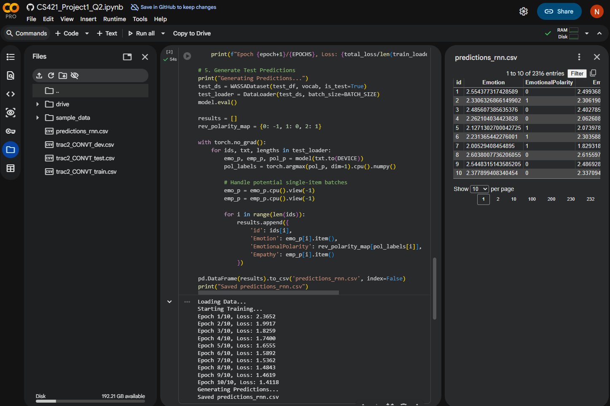

# Project Part One: Emotion and Empathy Prediction

## 1. Implementation Details

### Q1: ANN with Vector Embeddings 
...

### Q2: Fine-tuning RNN-based Model (Me)
* **Architecture:** A Multi-Task **LSTM** (Long Short-Term Memory) network.
* **Backbone:** 2-layer Bi-LSTM with 256 hidden units.
* **Heads:** Three separate fully connected layers branching from the final hidden state:
    * **Emotion Intensity:** Linear head → Regression (MSE Loss).
    * **Empathy Intensity:** Linear head → Regression (MSE Loss).
    * **Emotion Polarity:** Linear head → 3-class Classification (CrossEntropy Loss).
* **Optimization:** Adam optimizer with a learning rate of 0.001 and a dropout rate of 0.3 to prevent overfitting.

### Q3: Fine-tuning Transformers
...

### Q4: Prompting LLMs (Me)
* **Model Used:** ChatGPT (GPT-4o).
* **Technique:** **Few-Shot Prompting**. We provided the model with context from the news stories and 3 examples of turns with their associated gold labels to guide the scoring of intensity (1-5) and polarity.
* **Evaluation:** Conducted on 5 conversations, each exceeding 10 utterances, to ensure the model captured the conversational dynamics as required.

---

## 2. Results on Development Set
*Note: Regression tasks are measured in Mean Absolute Error (MAE); Polarity is measured in Accuracy/F1.*

| Method | Emotion (MAE) | Empathy (MAE) | Polarity (F1) |
| :--- | :--- | :--- | :--- |
| **Q1: ANN** | [...] | [...] | [...] |
| **Q2: RNN** | 0.5247 | 0.7621 | 0.6730 |
| **Q3: BERT** | [...] | [...] | [...] |

---

## 3. Preprocessing and Model Choices
* **Robust Data Loading:** To handle formatting inconsistencies in the WASSA 2024 dataset (unescaped commas in text fields), we implemented a custom loading script using the `python` engine and `on_bad_lines='skip'`.
* **Shared Representations:** We chose a Multi-Task architecture for the RNN and Transformer models. By sharing the encoder backbone, the model learns a generalized understanding of the conversation's emotional tone before branching into specific predictions.
* **RNN Choice:** LSTM was selected over a vanilla RNN to better handle the long-term dependencies present in multi-turn dialogues.

---

## 4. Instructions to Run Code

### Environment
* Python 3.10+
* Required Libraries: `torch`, `pandas`, `numpy`, `scikit-learn`, `transformers`

### Steps
1. **Upload Data:** Upload `trac2_CONVT_train.csv`, `trac2_CONVT_dev.csv`, and `trac2_CONVT_test.csv` to the root directory/Colab session storage.
2. **GPU Setup:** Ensure your environment has a GPU enabled (e.g., T4 GPU in Google Colab).
3. **Execution:** Run the Jupyter Notebook or Python script. 
4. **Outputs:** The script will generate three files:
   - `predictions_ann.csv`
   - `predictions_rnn.csv`
   - `predictions_bert.csv`

---

## 5. Training Progress
Below is the visual evidence of the model training and the GPU utilization.

